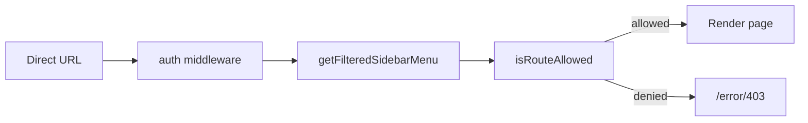
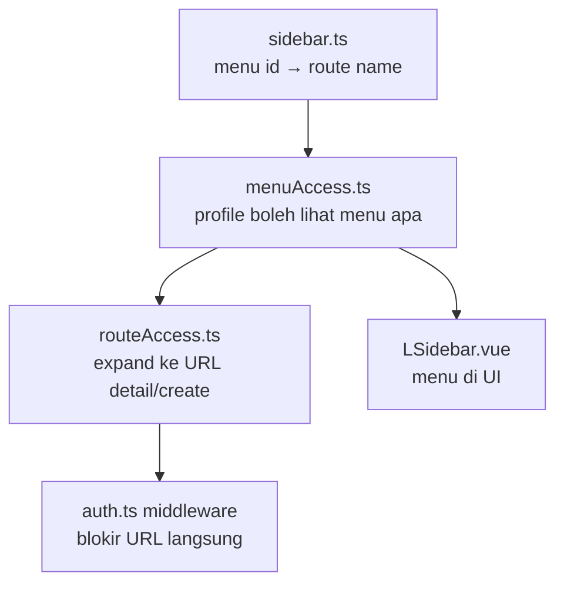

# Sidebar component review
_Exported on 7/9/2026 at 01:02:15 GMT+7 from Cursor (3.5.33)_

---

**User**

@tugas_akhir-eprocurement-frontend/src/components/layout/sidebar/LSidebar.vue @tugas_akhir-eprocurement-frontend/AuditCheck.md 

---

**Cursor**

Reviewing the referenced files to understand the task and draft a plan.


Exploring the router setup, guards, and permission system to analyze the direct-URL bypass.


Verifying key integration points and edge cases before drafting the plan.


Creating the implementation plan from the analysis.


---

**User**

Implement the plan as specified, it is attached for your reference. Do NOT edit the plan file itself.

To-do's from the plan have already been created. Do not create them again. Mark them as in_progress as you work, starting with the first one. Don't stop until you have completed all the to-dos.

---

**Cursor**

Implementing route protection per the plan. Starting by extracting menu access logic from `LSidebar.vue`.


Restoring the full sidebar registry, then creating the shared access modules.


Fixing route expansion: profile 3185 must not inherit create routes from list-route overrides.


Creating and running a route-access validation script for the test matrix.


Fixing menu access: adding missing admin invoice routes and the vendor e-invoice menu.


Route protection is implemented. Summary of what changed:

## What was implemented

### 1. Shared menu access — [`src/core/utils/menuAccess.ts`](E:/Datasea Project/final_project/tugas_akhir-eprocurement-frontend/src/core/utils/menuAccess.ts)
- Moved all `profileId` / `vendorCode` sidebar logic out of `LSidebar.vue`
- Consolidated three duplicate `3200` branches into one clear flow (vendor+3200 → narrow; 3200 → full admin)
- Vendor users now correctly include the `e-invoice` menu (fixes invoice list access)

### 2. Route guard — [`src/core/utils/routeAccess.ts`](E:/Datasea Project/final_project/tugas_akhir-eprocurement-frontend/src/core/utils/routeAccess.ts)
- Builds allowed routes from the filtered sidebar menu
- Expands list routes to detail/create/edit pages
- Profile-specific rules (e.g. 3180 can create RC; 3185 cannot)
- Redirects unauthorized access to `/error/403`

### 3. Auth middleware — [`src/middleware/auth.ts`](E:/Datasea Project/final_project/tugas_akhir-eprocurement-frontend/src/middleware/auth.ts)
- Calls `enforceRouteAccess()` after token check, user load, and email profile check

### 4. Sidebar refactor — [`LSidebar.vue`](E:/Datasea Project/final_project/tugas_akhir-eprocurement-frontend/src/components/layout/sidebar/LSidebar.vue)
- Reduced ~450 lines of inline permission logic to a single shared call

### 5. Complete menu registry — [`src/static/sidebar.ts`](E:/Datasea Project/final_project/tugas_akhir-eprocurement-frontend/src/static/sidebar.ts)
- Restored dashboard, vendor-management, full e-invoice, userManagement, workflow, and system modules

## How it works



## Validation
- Production build passes
- Profile matrix script passes for 3180, 3002, 3185, vendor, and 3200
- Notification deep links (`receivingConfirmationDetail`, `goodsReceiptListDetail`, `invoiceDetail`) work for authorized profiles

Run the validation script anytime with:
```bash
npx jiti scripts/validate-route-access.ts
```

---

**User**

ini untuk apa ? :
npx jiti scripts/validate-route-access.ts

---

**Cursor**

`npx jiti scripts/validate-route-access.ts` dipakai untuk **mengetes aturan route protection secara otomatis di terminal**, tanpa perlu login manual lewat browser.

## Fungsinya

Script [`scripts/validate-route-access.ts`](E:/Datasea Project/final_project/tugas_akhir-eprocurement-frontend/scripts/validate-route-access.ts) mengecek apakah logic di `routeAccess.ts` / `menuAccess.ts` sudah benar, dengan mensimulasikan beberapa profil user:

| Profil | Contoh yang dicek |
|---|---|
| **3180** (Warehouse Checker) | Boleh ke RC list/create, **tidak** boleh ke user management |
| **3002** (Finance AP) | Boleh ke invoice verification, **tidak** boleh ke RC create |
| **3185** (Warehouse Approver) | Boleh ke RC detail, **tidak** boleh ke RC create |
| **Vendor** | Boleh ke delivery notes & invoice list, **tidak** boleh ke verification |
| **3200** (Admin) | Boleh ke semua route admin |

Juga mengetes **deep link notifikasi** (mis. `goodsReceiptListDetail`, `invoiceDetail`, `receivingConfirmationCreate`).

## Kenapa pakai `jiti`?

`jiti` menjalankan file TypeScript langsung di Node.js, termasuk alias import `@/` — jadi script bisa import modul Vue/TS tanpa build dulu.

## Output yang diharapkan

```
All route access validations passed.
```

Kalau ada rule yang salah, script menampilkan `FAIL` dan exit code `1`.

## Penting

Ini **bukan bagian dari aplikasi production** — hanya alat bantu developer/QA saat:
- Mengubah `menuAccess.ts` atau `routeAccess.ts`
- Menambah profil/menu baru
- Memastikan direct URL bypass sudah terblokir sesuai matrix di plan

Untuk verifikasi end-to-end di browser, tetap perlu login dengan user asli dan coba akses URL langsung. Script ini hanya shortcut untuk regression check di terminal.

---

**User**

Apakah konfigurasi sekarnag sudah cover up semua profile id yang sebelumnya terdaftar di @tugas_akhir-eprocurement-frontend/src/components/layout/sidebar/LSidebar.vue  ?

---

**Cursor**

Membandingkan `menuAccess.ts` saat ini dengan logic profil yang ada di `LSidebar.vue` asli.


**Ya — semua `profileId` yang sebelumnya ada di `LSidebar.vue` sudah tercover** di [`menuAccess.ts`](E:/Datasea Project/final_project/tugas_akhir-eprocurement-frontend/src/core/utils/menuAccess.ts), dan `LSidebar.vue` sekarang memanggil fungsi yang sama:

```115:115:E:/Datasea Project/final_project/tugas_akhir-eprocurement-frontend/src/components/layout/sidebar/LSidebar.vue
const filteredSidebarMenu = computed(() => getFilteredSidebarMenu(userStore.userData))
```

## Mapping profileId lama → konfigurasi baru

| Kategori | Profile ID | Status |
|---|---|---|
| Admin penuh | `3200` | ✅ `filterAdminMenu(true)` |
| Vendor admin | `3200` + `vendorCode` | ✅ Akses sempit (invoice non-PO saja) |
| Internal submitter | `3001` | ✅ |
| Finance AP Officer | `3002` | ✅ |
| Accounting & Tax | `3003` | ✅ |
| Finance AP Supervisor | `3004` | ✅ |
| Warehouse Checker | `3180` | ✅ |
| Warehouse Approver | `3185` | ✅ |
| Vendor (umum) | Ada `vendorCode` | ✅ |
| Vendor khusus | `3192` | ✅ |
| Profile khusus | `3132` | ✅ |
| Non-PO verification | `3029`, `3075`, `3036`, `3066`, `3030`, `3089`, `3028`, `3193`, `3194` | ✅ |
| Non-PO approval | `3201`, `3202` | ✅ |
| **Fallback default** | Profile lain / tidak terdaftar | ✅ `getDefaultMenu()` |

Urutan pengecekan di `menuAccess.ts` mengikuti logic lama: spesifik dulu (`3200`, `3001`, …), lalu vendor, lalu default.

---

## Perbedaan kecil saat konsolidasi (perlu diketahui)

Bukan profile yang hilang, tapi ada **3 penyesuaian** dibanding behavior runtime lama:

### 1. `3200` + `vendorCode`
- **Dulu:** Branch `vendorCode && 3200` **tidak pernah jalan** karena `3200` sudah ketangkap di branch pertama → vendor admin dapat akses penuh.
- **Sekarang:** Dicek lebih dulu → vendor admin hanya `invoice-list-non-po`. Ini perbaikan logic, bukan kehilangan coverage.

### 2. Admin `3200` (tanpa vendorCode)
- **Dulu (branch pertama yang aktif):** Tidak include menu create `receiving-confirmation` / `delivery-notes`, dan tidak include `invoice-verification` / `invoice-approval`.
- **Sekarang:** `filterAdminMenu(true)` include semua itu + route verifikasi/approval. Admin dapat akses **lebih luas** dari sidebar lama.

### 3. Vendor umum (`vendorCode` tanpa profile khusus)
- **Dulu:** Menu `e-invoice` tidak masuk filter parent, jadi `invoice-list` tidak muncul di sidebar (bug).
- **Sekarang:** `e-invoice` ditambahkan eksplisit → vendor bisa akses invoice list. Perbaikan, bukan pengurangan.

---

## Profile yang tidak explicitly listed

Profile di luar daftar di atas **tetap tercover** lewat **default branch**:

```90:96:E:/Datasea Project/final_project/tugas_akhir-eprocurement-frontend/src/core/utils/menuAccess.ts
function getDefaultMenu(): ISidebarMenu[] {
  return sidebarMenu
    .filter((menu) => menu.id !== 'company-information' && menu.id !== 'vendor-tender')
    .map((menu) => ({
      ...menu,
      child: menu.child ? menu.child.filter((child) => child.id !== 'vendor-blacklist') : [],
    }))
}
```

Sama persis dengan fallback di `LSidebar.vue` lama.

---

## Route guard ikut logic yang sama

`routeAccess.ts` memakai `getFilteredSidebarMenu()` yang sama, jadi sidebar dan route guard **selalu selaras** untuk semua profile di atas.

**Kesimpulan:** Semua profileId yang pernah terdaftar di `LSidebar.vue` sudah tercover. Satu-satunya perubahan behavior yang perlu di-review bisnis: **`3200` + `vendorCode`** (dulu full admin, sekarang terbatas) — sisanya coverage sama atau lebih baik.

---

**User**

Kalau mau mapping URL mana saja yang boleh diakses itu dimana ?
Seperti, untuk sekarang Vendor tidak bisa create Delivery Note, nah itu mau saya tambahkan 

---

**Cursor**

Menelusuri alur konfigurasi akses URL dan lokasi tepat untuk menambahkan akses create Delivery Note bagi Vendor.


Mapping akses URL ada di **2 file utama**, plus registry menu sebagai referensi.

## Alur konfigurasi



| File | Fungsi | Contoh |
|---|---|---|
| [`src/static/sidebar.ts`](E:/Datasea Project/final_project/tugas_akhir-eprocurement-frontend/src/static/sidebar.ts) | Daftar menu + mapping ke **route name** | `delivery-notes` → `deliveryNotes` |
| [`src/core/utils/menuAccess.ts`](E:/Datasea Project/final_project/tugas_akhir-eprocurement-frontend/src/core/utils/menuAccess.ts) | **Profile mana boleh akses menu apa** | Vendor: hanya `delivery-notes-list` |
| [`src/core/utils/routeAccess.ts`](E:/Datasea Project/final_project/tugas_akhir-eprocurement-frontend/src/core/utils/routeAccess.ts) | Expand menu → **URL turunan** (detail, create) | `delivery-notes` → `deliveryNotesCreate` |

---

## Kasus Vendor + Create Delivery Note

Saat ini Vendor hanya punya list, **bukan** create:

```234:235:E:/Datasea Project/final_project/tugas_akhir-eprocurement-frontend/src/core/utils/menuAccess.ts
      if (menu.id === 'digital-receiving-confirmation') {
        return filterChildIds(menu, ['mock-sap-list', 'delivery-notes-list', 'goods-receipt-list'])
```

Route create sudah terdaftar di `routeAccess.ts` — cukup aktifkan menu item `delivery-notes`:

```76:78:E:/Datasea Project/final_project/tugas_akhir-eprocurement-frontend/src/core/utils/routeAccess.ts
const CREATE_ROUTES_BY_CHILD_ID: Record<string, readonly string[]> = {
  'receiving-confirmation': ['receivingConfirmation', 'receivingConfirmationCreate'],
  'delivery-notes': ['deliveryNotes', 'deliveryNotesCreate'],
```

Mapping di `sidebar.ts`:

| Menu child id | Route name | URL path |
|---|---|---|
| `delivery-notes` | `deliveryNotes` | `/delivery-notes` |
| `delivery-notes-list` | `deliveryNotesList` | `/delivery-notes/list` |
| *(auto dari `delivery-notes`)* | `deliveryNotesCreate` | `/delivery-notes/create` |
| *(auto dari list)* | `deliveryNotesDetail` | `/delivery-notes/detail/:id` |

---

## Yang perlu diubah (1 baris)

Di **`menuAccess.ts`**, branch vendor — tambahkan `'delivery-notes'`:

```typescript
// Sebelum
return filterChildIds(menu, ['mock-sap-list', 'delivery-notes-list', 'goods-receipt-list'])

// Sesudah
return filterChildIds(menu, ['mock-sap-list', 'delivery-notes', 'delivery-notes-list', 'goods-receipt-list'])
```

Itu cukup untuk:
1. Menampilkan menu **Create Delivery Notes** di sidebar
2. Mengizinkan URL `/delivery-notes` dan `/delivery-notes/create`
3. Tetap mengizinkan list & detail (via `delivery-notes-list`)

**Tidak perlu** ubah `routeAccess.ts` kecuali ada route dengan nama non-standar yang belum tercover.

---

## Kapan perlu sentuh `routeAccess.ts`?

Hanya jika:
- Route create/detail **tidak** mengikuti pola menu id (seperti RC create untuk profile 3180)
- Perlu override khusus di `CHILD_ROUTE_OVERRIDES` atau `getProfileSpecificRoutes()`

Contoh: profile 3180 dapat `receivingConfirmationCreate` tanpa menu create, lewat `getProfileSpecificRoutes()`.

---

## Verifikasi setelah ubah

```bash
npx jiti scripts/validate-route-access.ts
```

Lalu tambahkan test case vendor di [`scripts/validate-route-access.ts`](E:/Datasea Project/final_project/tugas_akhir-eprocurement-frontend/scripts/validate-route-access.ts):

```typescript
allowed: [..., 'deliveryNotesCreate', 'deliveryNotes'],
blocked: [...] // pastikan route lain tetap blocked
```

Kalau mau, saya bisa langsung terapkan perubahan di `menuAccess.ts` dan update script validasinya.

